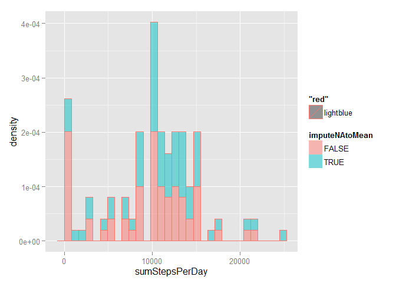

# Reproducible Research: Peer Assessment 1


# Loading and preprocessing the data
Loading the data and storing for future use.


```
## Warning: package 'dplyr' was built under R version 3.1.2
```

```
## 
## Attaching package: 'dplyr'
## 
## The following object is masked from 'package:stats':
## 
##     filter
## 
## The following objects are masked from 'package:base':
## 
##     intersect, setdiff, setequal, union
```

```
## Warning: package 'lubridate' was built under R version 3.1.2
```

```r
activity_record <- read.csv("activity.csv",header=TRUE)
activity_record <- tbl_df(activity_record) 
```

# What is mean total number of steps taken per day?

Calculate the total number of steps taken per day. Depicting a histogram to show the total number of steps taken each day. 


```r
sum_daily_activity <- activity_record%>%
                      group_by(date) %>%
                      summarise(sum(steps,na.rm=TRUE))
names(sum_daily_activity)[2] <- "sumStepsPerDay"
hist(sum_daily_activity$sumStepsPerDay,xlab="Steps per day",breaks=30,col="lightblue",border="darkblue",main="")
```

 

#Solution 
Mean of the total number of steps taken per day is 9354.23, Median of the total number of steps taken per day is , 1.0395\times 10^{4}

# What is the average daily activity pattern?

Making a time series plot of the 5-minute interval (x-axis) and the average number of steps taken, averaged across all days (y-axis). 
Make a plot by grouping based on intervals and then average number of steps per day. 
We find the interval where the average is maximum across all the days. 


```r
mean_interval <- activity_record%>%
                 group_by(interval) %>%
                 summarise(mean(steps,na.rm=TRUE))
names(mean_interval)[2] <- "averageStepsForInterval"
plot(mean_interval,type="l")
```

 

```r
id = mean_interval[which(mean_interval$averageStepsForInterval== max(mean_interval$averageStepsForInterval)),]
```
#Solution 
5-minute Interval containing maximum number of steps on an average is ,835 , with a average value of,206.17. This is around the time 3 hours which could be a walk after lunch ! 


# Imputing missing values

Find the total number of values were steps are not recorded. We will replace the non recorded values with mean for the day. 

Create a new dataset that is equal to the original dataset but with the missing data filled in.

A histogram is plotted with both the total number of steps,mean and median of steps taken each day before and after removing NA values . 
Do these values differ from the estimates from the first part of the assignment? What is the impact of imputing missing data on the estimates of the total daily number of steps?


```r
numNAStepEntries <- nrow(activity_record[is.na(activity_record$steps),])
replicaActivityRecord <- activity_record
replacedNA <- merge(replicaActivityRecord,mean_interval)
replacedNA$steps[is.na(replacedNA$steps)] <- replacedNA$averageStepsForInterval[is.na(replacedNA$steps)]


new_sum_daily_activity <- replacedNA%>% group_by(date) %>% summarise(sum(steps,na.rm=TRUE),mean(steps))
names(new_sum_daily_activity)[2] <- "sumStepsPerDay"
names(new_sum_daily_activity)[3] <- "meanStepsPerDay"
hist(sum_daily_activity$sumStepsPerDay,xlab="Steps per day",breaks=50,col=rgb(0,1,0,0),border="darkblue",main="",ylim=NULL,xlim=range(sum_daily_activity$sumStepsPerDay))
hist(new_sum_daily_activity$sumStepsPerDay,add=T,col=rgb(1,0,1,0))
```

 

```r
newMeanStepsDailyActivity <- round(mean(new_sum_daily_activity$sumStepsPerDay),1)
newMedianStepsDailyActivity <- round(median(new_sum_daily_activity$sumStepsPerDay),1)
```
#Solution
Total number of missing values in the dataset is,2304

After replacing the NA values with interval mean we get , Mean of the total number of steps taken per day is 1.07662\times 10^{4}, Median of the total number of steps taken per day is , 1.07662\times 10^{4}

Values before replacing Mean of the total number of steps taken per day is 9354.23, Median of the total number of steps taken per day is , 1.0395\times 10^{4}

The variations in the histogram is smoothened by replacing the NA values. The mean and median have shifted.
## Are there differences in activity patterns between weekdays and weekends?

For this part the weekdays() function may be of some help here. Use the dataset with the filled-in missing values for this part.

Create a new factor variable in the dataset with two levels - "weekday" and "weekend" indicating whether a given date is a weekday or weekend day.

Make a panel plot containing a time series plot (i.e. type = "l") of the 5-minute interval (x-axis) and the average number of steps taken, averaged across all weekday days or weekend days (y-axis). See the README file in the GitHub repository to see an example of what this plot should look like using simulated data.


```r
tm_activity_record <- replacedNA %>% mutate(weekday=wday(as.POSIXlt(activity_record$date),label=FALSE,abbr = TRUE))
```
